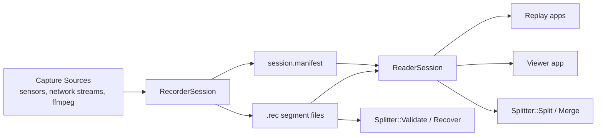
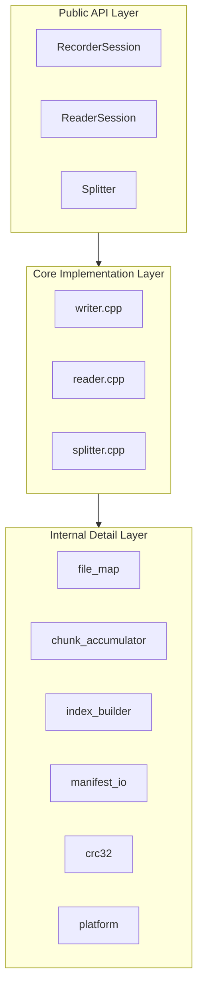

# Architecture Overview

## Purpose

`RecordReplayLibrary` is a C++17 library and tool suite for:

- recording timestamped multi-channel byte streams into a `.rec` binary format
- replaying/iterating messages from `.rec` sessions
- splitting/merging sessions after recording
- validating/recovering session integrity
- inspecting recordings in an SDL2 + ImGui viewer

## System Context

## Repository Shape

- `include/recplay/`: public API and public format/types contracts
- `src/`: core implementations (`writer`, `reader`, `splitter`, `session`, `version`)
- `src/detail/`: internal portability, file mapping, manifest, indexing, compression helpers
- `tests/`: unit and roundtrip tests
- `examples/`: sample CLI programs for recording and replay
- `apps/viewer/`: desktop inspection UI

## Top-Level Runtime Layers

## Primary Artifacts

- `session.manifest`: JSON metadata for channels and segment list
- `.rec` segment: binary file with:
  - fixed header
  - record stream (`SESSION_START`, `CHANNEL_DEF`, `DATA`/`CHUNK`, `INDEX`, `ANNOTATION`, `SESSION_END`)
  - fixed footer

## Core Architectural Characteristics

- Status-code API (`recplay::Status`), not exception-driven for normal failures
- Payload-agnostic library: payload bytes are not interpreted by core writer/reader
- Per-channel compression support (`None`, `LZ4`, `Zstd`) via chunk accumulation
- Memory-mapped I/O for read and write paths
- Built-in indexing for seek acceleration
- Split/merge utilities work at message level using reader/writer pipeline

## Non-Goals of the Core Library

- Schema-specific payload decoding
- Hard real-time scheduling guarantees
- Internal multi-thread synchronization around sessions (session objects are not thread-safe by default)
