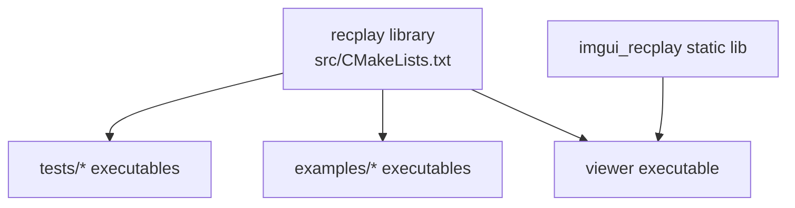

# Build and Test Architecture

## Build System

Build is CMake-based with one top-level library target and optional consumers.

Top-level options (from `CMakeLists.txt`):

- `RECPLAY_BUILD_TESTS`
- `RECPLAY_BUILD_EXAMPLES`
- `RECPLAY_BUILD_APPS`
- `RECPLAY_ENABLE_LZ4`
- `RECPLAY_ENABLE_ZSTD`
- `RECPLAY_ENABLE_CRC`
- `RECPLAY_INSTALL`

## Target Graph

## Core Library Build Characteristics

- C++17 required
- strict warnings enabled
  - MSVC: `/W4 /WX`
  - GCC/Clang: `-Wall -Wextra -Wpedantic -Werror`
- optional compile definitions:
  - `RECPLAY_HAS_LZ4`
  - `RECPLAY_HAS_ZSTD`
  - `RECPLAY_CRC_ENABLED`

## External Dependencies

Core library:

- no mandatory third-party runtime dependency for basic operation
- optional compression backends via LZ4/Zstd discovery

Tests:

- GoogleTest via system package or `FetchContent`

Viewer:

- SDL2 (find package or `FetchContent`)
- OpenGL
- ImGui docking branch via `FetchContent`

## Test Architecture

### Test Categories

- format contract tests (`test_format.cpp`)
- type/default tests (`test_channel.cpp`, `test_session.cpp`)
- writer/reader API behavior tests (`test_writer.cpp`, `test_reader.cpp`)
- splitter behavior tests (`test_splitter.cpp`)
- file-mapped I/O tests (`test_file_map.cpp`)
- roundtrip integration tests (`test_roundtrip.cpp`)

### Execution

- CTest via `gtest_discover_tests`
- current suite validates:
  - binary format invariants
  - status propagation on invalid API inputs
  - seek/read behavior
  - split/merge roundtrip
  - duplicate-channel merge path
  - split naming/dir pattern behavior

## Packaging/Install

When `RECPLAY_INSTALL=ON`:

- installs headers under `${CMAKE_INSTALL_INCLUDEDIR}/recplay`
- exports CMake package config and target files
- provides `recplay::recplay` import target for downstream consumers
