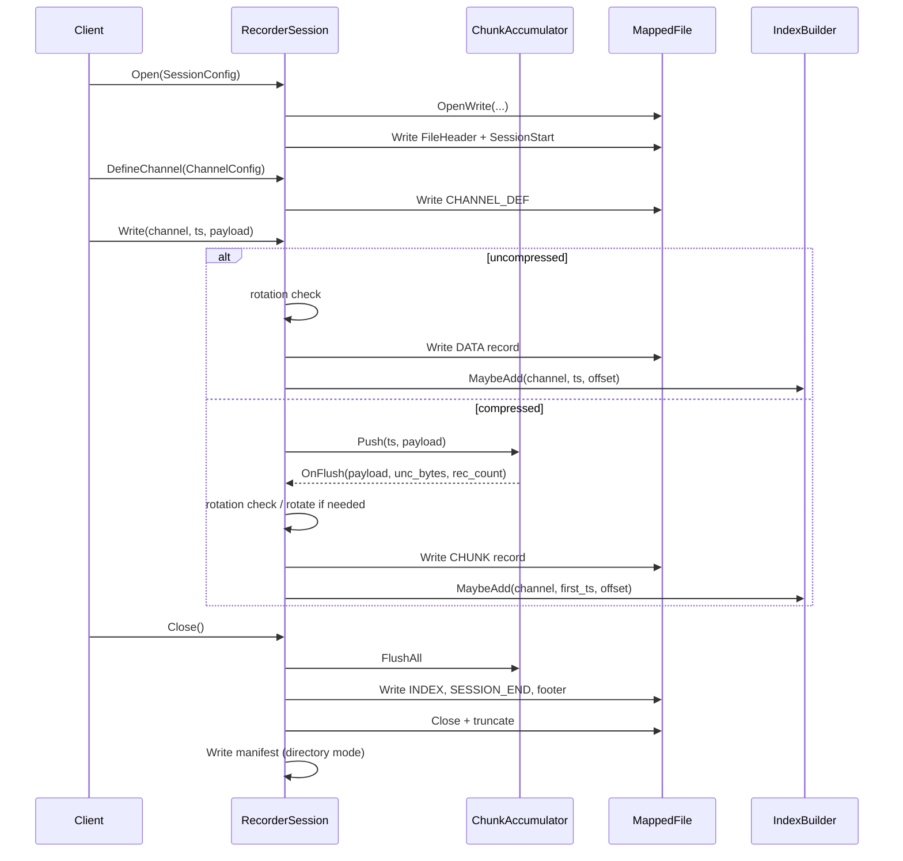
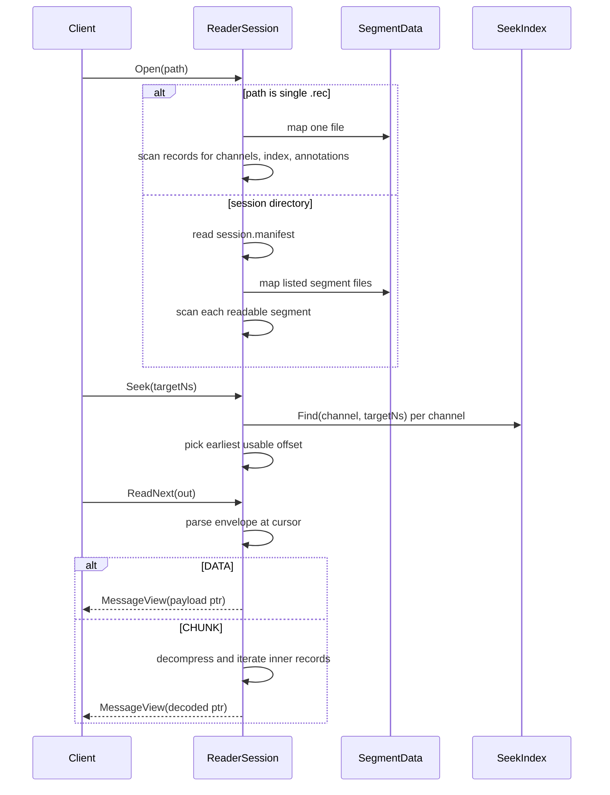
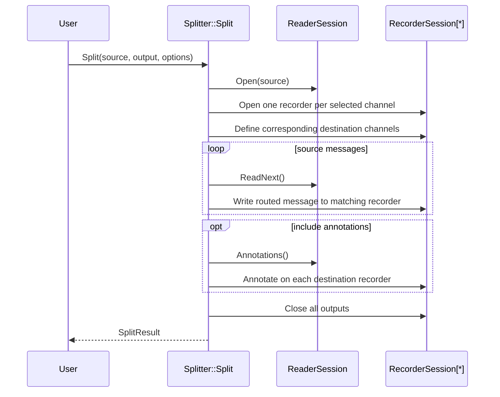
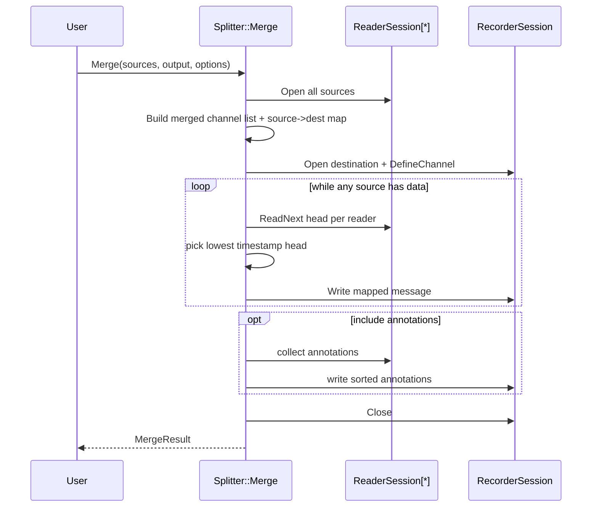

# Runtime Flow Architecture

## Recording Flow

## Read Flow

## Split Flow

## Merge Flow

## Validation and Recovery Flow

Validation:

1. read manifest
2. for each segment:
   - check header/footer magic
   - verify footer CRC
   - walk records and verify envelope CRCs
   - compare counted records vs footer record count

Recovery:

1. read manifest, or discover `.rec` files when manifest is missing
2. scan each segment to find valid record boundary
3. rebuild index and footer in temporary file
4. replace original file with recovered output
5. rewrite manifest

## Concurrency Model

- `RecorderSession`, `ReaderSession`, and `Splitter` APIs are used in a single-threaded manner per instance in current implementation.
- Example programs may use worker threads, but synchronize access around shared recorder calls explicitly.
