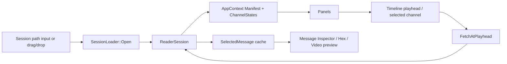

# Viewer and Examples Architecture

## Viewer (`apps/viewer`)

The viewer is an SDL2 + OpenGL + ImGui desktop app that uses `ReaderSession` for inspection.

### Main Components

- `App`
  - owns SDL window + GL context
  - owns ImGui lifecycle
  - drives frame loop and panel rendering
- `AppContext`
  - shared mutable state for all panels
  - holds opened `ReaderSession`, manifest snapshot, playhead, selected message, UI channel states
- `SessionLoader`
  - open/close helper around `ReaderSession`
  - initializes `AppContext` channel UI defaults
- Panels (`panels/*`)
  - Session Info
  - Channel List
  - Timeline
  - Message Inspector
  - Annotations

### Viewer Data Flow

### Panel Interaction Pattern

- panels read and write `AppContext` in `Draw(AppContext&)`
- no direct panel-to-panel references
- coordination happens through shared fields:
  - `PlayheadNs`
  - `InspectedChannelId`
  - `SelectedMessage`
  - `ChannelStates[*].Visible`

## Example Programs (`examples/`)

### `record_ffmpeg`

- demonstrates creating one recording session from ffmpeg test sources
- writes channels through `RecorderSession`

### `record_multi_pattern`

- writes multiple synthetic video-like channels in one process
- useful for channel fan-out testing

### `record_net_streams`

- captures multiple network streams
- demonstrates multi-source capture and synchronized write path
- includes a PEAK CAN stub path in current implementation

### `replay_ffplay`

- opens a session via `ReaderSession`
- replays selected stream content toward ffplay

## How Examples Relate to Core Architecture

- examples exercise writer/reader contracts directly
- examples are integration-style usage references, not strict API tests
- unit/roundtrip tests in `tests/` remain the canonical regression safety net
